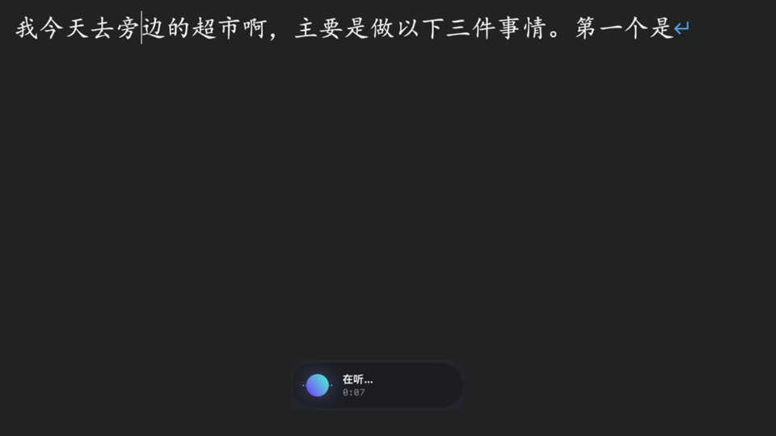
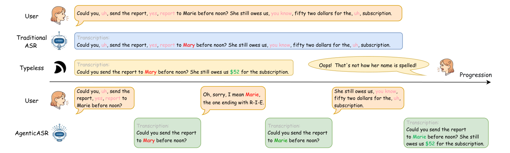
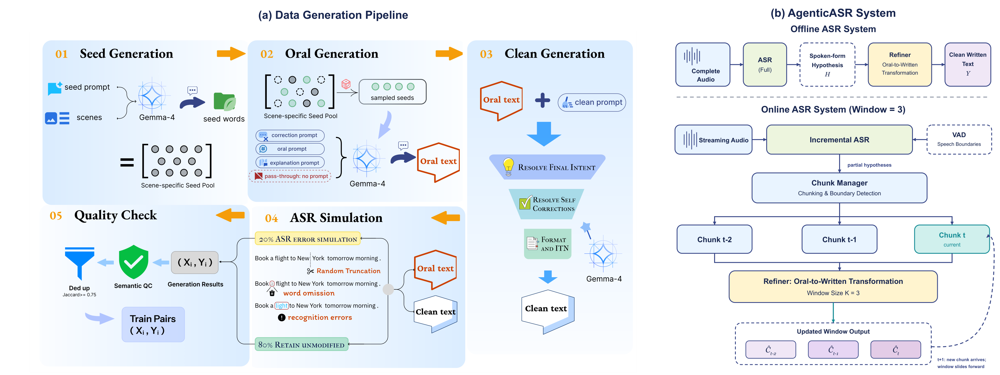

# AgenticASR: Refining Speech Recognition in Real-World Scenarios via an Agentic Approach

<p align="center">
  <a href="https://arxiv.org/html/2607.28175v1"></a>
  <a href="https://anxmuy.github.io/blog/agenticasr/"></a>
  <a href="https://vibexasr.speech.wiki/"></a>
  <a href="https://huggingface.co/datasets/Andrew0425/AASR-Bench"></a>
  <a href="https://www.modelscope.cn/datasets/MuyuanJ/AASR-Bench"></a>
  <a href="https://huggingface.co/Andrew0425/AgenticASR-Refiner/tree/main"></a>
  <a href="https://www.modelscope.cn/models/MuyuanJ/AgenticASR-Refiner"></a>
</p>

## News

- **2026-07-30:** Paper, code, AASR-Bench, and Refiner checkpoint are released.

> **Bilingual:** AgenticASR supports both English and Chinese speech-to-clean-text refinement.
>
> **ASR-agnostic:** The Refiner is decoupled from the recognizer and can be attached to any ASR frontend that produces text hypotheses.

## Bilingual Demo

<table>
  <tr>
    <th width="50%">English Demo</th>
    <th width="50%">中文演示</th>
  </tr>
  <tr>
    <td width="50%" align="center">
      <a href="MediaSup/en_demo.mp4"></a>
      <br><a href="MediaSup/en_demo.mp4"><b>▶ Play English demo</b></a>
    </td>
    <td width="50%" align="center">
      <a href="MediaSup/CH_demo.mp4"></a>
      <br><a href="MediaSup/CH_demo.mp4"><b>▶ 播放中文演示</b></a>
    </td>
  </tr>
</table>

<p align="center">
  
</p>

<p align="center">
  
</p>

## What Is Included

<table>
  <tr>
    <td width="25%"><b>Benchmark</b><br><sub>AASR-Bench evaluates content, formatting, filtering, and self-correction.</sub></td>
    <td width="25%"><b>Data Pipeline</b><br><sub>Generate Oral/Clean pairs, simulate ASR noise, run QC, and export training data.</sub></td>
    <td width="25%"><b>Refiner</b><br><sub>Train or run the ASR text correction model with the paper prompt.</sub></td>
    <td width="25%"><b>Streaming System</b><br><sub>VAD, incremental ASR, bounded chunks, and K=3 refinement for the desktop App.</sub></td>
  </tr>
</table>

The packaged Windows/macOS application is available from the [VibeXASR product page](https://vibexasr.speech.wiki/). This repository contains the research code and reproducible core implementation.

## Installation

```bash
python -m venv .venv
source .venv/bin/activate
python -m pip install --upgrade pip
python -m pip install -r requirements.txt
python -m pip install -r system/requirements.txt
```

Refiner training additionally requires [LLaMA Factory](https://github.com/hiyouga/LLaMA-Factory). Install it separately before running `llamafactory-cli train`.

## Quick Start

<table>
  <tr>
    <td width="33%"><b>01 · Generate</b><br><sub>Create Refiner training pairs.</sub></td>
    <td width="33%"><b>02 · Refine</b><br><sub>Run a trained Refiner on ASR JSONL.</sub></td>
    <td width="33%"><b>03 · Train</b><br><sub>Fine-tune a Refiner with LLaMA Factory.</sub></td>
  </tr>
</table>

### 01 · Generate Training Data

Start an OpenAI-compatible vLLM service, or configure an OpenRouter-compatible service:

```bash
export VLLM_MODEL_NAME=/path/to/gemma-4-31b-it
export VLLM_BASE_URL=http://127.0.0.1:8000/v1
python run_pipeline.py
```

The final records are written to `data/final/`. See [pipeline/README.md](pipeline/README.md) for the stage layout.

### 02 · Run Refiner Inference

The batch inference entry point is `experiments/scripts/postprocess_asr.py`:

```bash
python experiments/scripts/postprocess_asr.py \
  /path/to/asr_output.jsonl \
  /path/to/refined_output.jsonl \
  --model /path/to/refiner-checkpoint
```

Each input record must contain `source_record_id` and `output.raw_text`. The checkpoint uses the Refiner system prompt defined in the inference and training code.

### 03 · Train the Refiner

First export the finalized pipeline records. Use paths that exist on your machine:

```bash
python pipeline/scripts/export_sft.py \
  --inputs /path/to/AgenticASR/data/final/train.jsonl \
  --train-output /path/to/llamafactory-data/train_sft.json \
  --val-output /path/to/llamafactory-data/val_sft.json
```

Register those files in the LLaMA Factory dataset directory at `/path/to/llamafactory-data/dataset_info.json`:

```json
{
  "refiner_train": {"file_name": "train_sft.json"},
  "refiner_val": {"file_name": "val_sft.json"}
}
```

Then edit a copy of `refiner.yaml` and replace every machine-specific path:

```yaml
model_name_or_path: /path/to/base-model
dataset_dir: /path/to/llamafactory-data
dataset: refiner_train
eval_dataset: refiner_val
output_dir: /path/to/refiner-output
```

Launch training with the edited configuration:

```bash
llamafactory-cli train /path/to/refiner.yaml
```

## Streaming AgenticASR

The `system/` implementation is the streaming core of the AgenticASR desktop App. It combines VAD, online sherpa-onnx ASR, stable text chunking, and a K=3 sliding-window Refiner. The current local backend uses MLX-LM on macOS; the full App path requires `--refiner`.

```bash
bash system/download_vad.sh /path/to/models
python -m system.live_asr \
  --wav /path/to/example.wav \
  --asr-dir /path/to/models/asr \
  --refiner /path/to/models/refiner-mlx
```

Use `--identity-refiner` only for ASR/chunking diagnostics. See [system/README.md](system/README.md) for VAD and model preparation.

## Benchmark Evaluation

Download `rubric.json` from [ModelScope](https://www.modelscope.cn/datasets/MuyuanJ/AASR-Bench) or [Hugging Face](https://huggingface.co/datasets/Andrew0425/AASR-Bench), then run the judge in `experiments/scripts/main.py` with `--rubric /path/to/rubric.json`. See [experiments/README.md](experiments/README.md).

## Module Documentation

- [Pipeline](pipeline/README.md)
- [Experiments and inference](experiments/README.md)
- [Streaming system](system/README.md)
- [Assets](assets/README.md)
